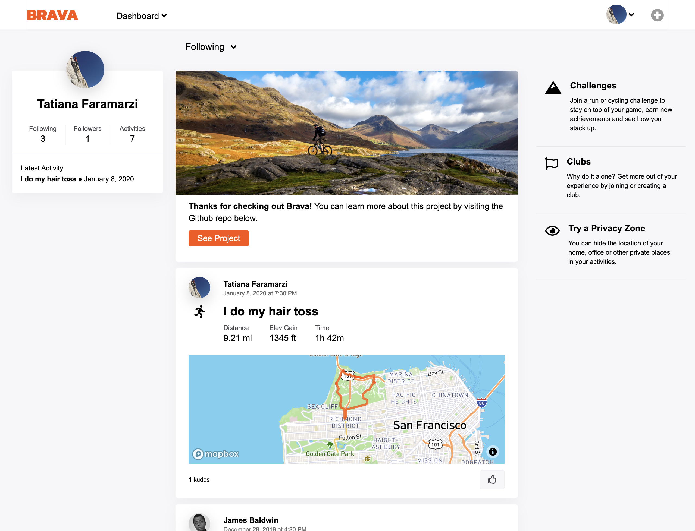
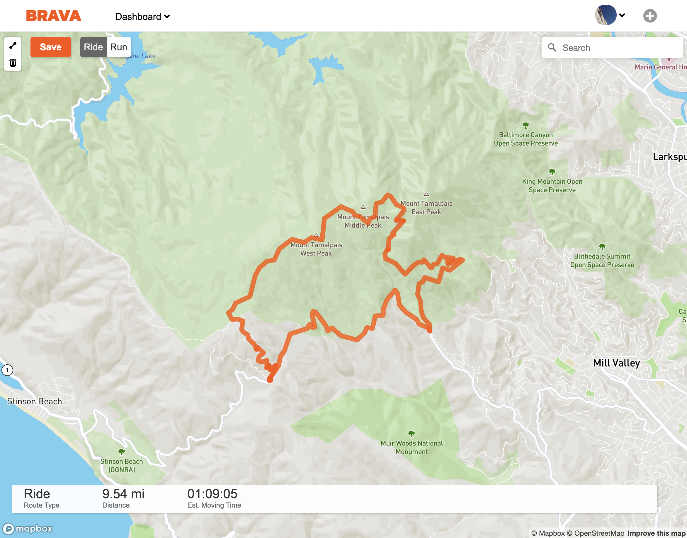
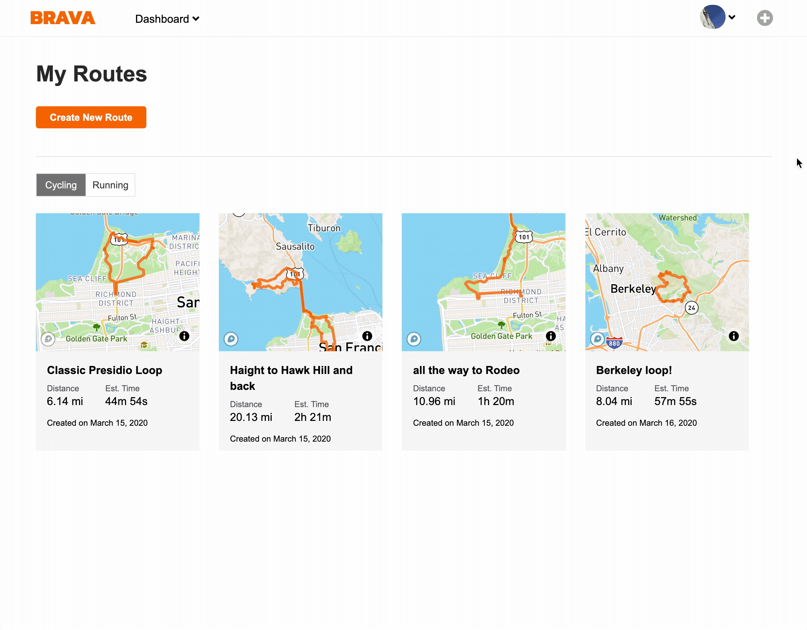

# Brava

Brava is a browser-based application allows runners and cyclists to track their workouts, and connect with other athletes. This application allows users to create and save outdoor workout routes, see stats for their workouts, and view the recent workouts of the athletes that they follow.

I built this application using React/Redux for the frontend and Ruby on Rails for the backend, with PostgreSQL to manage the database. I used JBuilder to format my JSON responses, and implemented user authentication using session tokens and the BCrypt library to one-way encrypt user passwords. All styling was accomplished with Sass-compiled CSS, and I used the Mapbox API for geographic interactivity. 

[Check out Brava!](https://tatiana-strava-clone.herokuapp.com/#/)



## Current Features

* User authentication: users can securely create an account and login, or they can tour the site using a demo account
* A splash page introduces users to the website, and guides them to the login or signup pages
* Once logged in, the user is directed to their dashboard, where they can toggle their activity feed to show either their own activities or their activities in conjunction with the activities of those athletes that they follow
* Users can "give kudos to" the activities of their followees
* A logged-in user can create a route through an interactive map that will allow them to plot their route points, and access the Mapbox Directions API to optimize their route based on the activity type — cycling or running
* A logged-in user can save the route that they create, which will then be accessible under their `My Routes` page





## Thinking about scale

Because it would not make sense to eagerly load the hundreds of activities that might appear on a user's dashboard, I decided to implement endless scrolling on the user's activity dashboard, while also allowing users to filter the activities they see. In my resource controller, I used conditional logic to return the appropriate activities based on a feed type query param (the user's own activities vs. their activities combined with their friends' activities), and set the offset to whatever number was passed as a query param from the frontend.

```ruby
    def index
        @ids = [current_user.id]
        if !params[:my_feed]
            current_user.followees.each { |u| @ids.push(u.id) }
        end
        @activities = Activity.where(user_id: @ids)
            .order(created_at: :desc)
            .limit(5)
            .offset(params[:offset])
        render :index
    end
```

On the frontend, I created two actions for fetching multiple activities: one that represented a first request of a certain type of activity, and another that represented an incremented request of the same type of activity. In the React component that managed this request, I stored the offset value in the component's state, and incremented it whenever a user scrolled to the bottom of the dashboard feed. Similarly, whenever a user toggles the types of activities that they want to see, the offset is reset, the value for the `my_feed` query param is updated, and a new request is made. 

```javascript
    export const fetchActivities = (offset = 0, my_feed = false) => {
        let URL = `/api/activities?offset=${offset}`
        if (my_feed) {
            URL += `&my_feed=${my_feed}`
        }

        return $.ajax({
            url: URL,
            method: 'GET'
        });
    };
```


